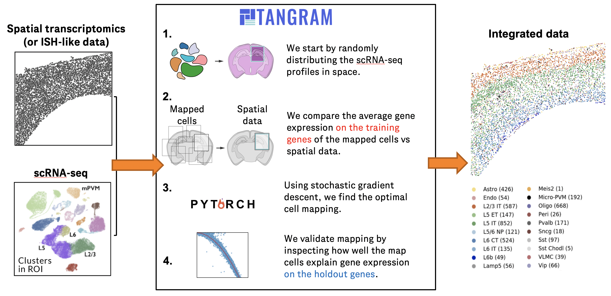

# Tutorial for spatial mapping using _Tangram_
- by Ziqing Lu <luz21@gene.com> and Tommaso Biancalani <biancalt@gene.com>.
- Last update: August 16th 2021

### What is _Tangram_?
_Tangram_ is a method for mapping single-cell (or single-nucleus) gene expression data onto spatial gene expression data. _Tangram_ takes as input a single-cell dataset and a spatial dataset, collected from the same anatomical region/tissue type. Via integration,  _Tangram_ <u>creates new spatial data by aligning the scRNAseq profiles in space</u>. This allows to project every annotation in the scRNAseq (_e.g._ cell types, program usage) on space.


### What do I use _Tangram_ for?
The most common application of _Tangram_ is to resolve cell types in space. Another usage is to correct gene expression from spatial data: as scRNA-seq data are less prone to dropout than (_e.g._) Visium or Slide-seq, the "new" spatial data generated by _Tangram_ resolve many more genes. As a result, we can visualize program usage in space, which can be used for ligand-receptor pair discovery or, more generally, cell-cell communication mechanisms. If cell segmentation is available, _Tangram_ can be also used for deconvolution of spatial data. If your single cell are multimodal, _Tangram_ can be used to spatially resolve other modalities, such as chromatin accessibility.

---
# 使用_Tangram_ 进行空间映射的教程
- 作者：Ziqing Lu <luz21@gene.com> 和 Tommaso Biancalani <biancalt@gene.com>
- 最后更新日期：2021年8月16日

### 什么是_Tangram_？
_Tangram_ 是一种将单细胞（或单核）基因表达数据映射到空间基因表达数据的方法。_Tangram_ 的输入包括来自同一解剖区域/组织类型的单细胞数据集和空间数据集。通过集成，_Tangram_ 通过在空间中对齐scRNAseq配置文件，<u>创建新的空间数据</u>。这允许将scRNAseq中的每个注释（例如细胞类型、程序使用）投影到空间中。

### 我可以使用_Tangram_ 做什么？
_Tangram_ 最常见的应用是在空间中解析细胞类型。另一种用途是从空间数据中校正基因表达：由于scRNA-seq数据不太容易出现丢失（例如Visium或Slide-seq），_Tangram_ 生成的“新”空间数据解析了更多基因。因此，我们可以在空间中可视化程序的使用情况，这可以用于发现配体-受体对或更一般的细胞间通信机制。如果存在细胞分割，_Tangram_ 还可用于对空间数据进行反卷积。如果您的单细胞数据是多模式的，_Tangram_ 可用于在空间中解析其他模态，例如染色质可及性。

***
### Frequently Asked Questions about _Tangram_

##### How is _Tangram_ different, than all the other deconvolution/mapping method?
- Validation. Most methods "validate" mappings by looking at known patterns or proportion of cell types. These are good sanity checks, but are hardly useful when mapping is used for discovery. In _Tangram_, mappings are validated by inspective the predictions of holdout genes (test transcriptome).


##### My scRNAseq/spatial data come from different samples. Can I still use _Tangram_?
- Yes. There is a clever variation invented by [Sten Linnarsson](http://linnarssonlab.org/), which consists of mapping _average_ cells of a certain cell type, rather than single cells. This method is much faster, and  smooths out variation in biological signal from different samples via averaging. However, it requires annotated scRNA-seq, sacrifices resolving biological variability at single-cell level. To map this way, pass `mode=cluster`.


##### Does _Tangram_ only work on mouse brain data?
- **No.** The original manuscript focused on mouse brain data b/c was funded by BICCN. We subsequently used _Tangram_ for mapping lung, kidney and cancer tissue. If mapping doesn't work for your case, that is hardly due to the complexity of the tissue.


##### Why doesn't _Tangram_ have hypotheses on the underlying model?
- Most models used in biology are probabilistic: they assume that data are generated according to a certain probability distribution, hence the hypothesis. But _Tangram_ doesn't work that way: the hypothesis is that scRNA-seq and spatial data are generated with the same process (_i.e._ same biology) regardless of the process.


##### Where do I learn more about _Tangram_?
- Check out our [documentation](https://tangram-sc.readthedocs.io/) for learning more about the method, or our [GitHub repo](https://github.com/broadinstitute/Tangram) for the latest version of the code. Tangram has been released in <cite data-cite="tangram">Biancalani, Scalia et al. Nature Methods (2021)</cite>.

---

### 关于_Tangram_的常见问题

##### _Tangram_ 与其他反卷积/映射方法有何不同？
- 验证。大多数方法通过查看已知模式或细胞类型的比例来“验证”映射。这些是很好的健全性检查，但在用于发现时几乎没有用处。在_Tangram_ 中，映射通过检查保留基因（测试转录组）的预测来进行验证。

##### 我的scRNAseq/空间数据来自不同的样本。我仍然可以使用_Tangram_ 吗？
- 可以。由[Sten Linnarsson](http://linnarssonlab.org/)发明的一种巧妙的变体允许将某种细胞类型的_平均_细胞映射到空间，而不是单个细胞。这种方法要快得多，并通过平均化来消除来自不同样本的生物信号的变异。然而，它需要有注释的scRNA-seq数据，牺牲了在单细胞水平解析生物变异性的能力。要以这种方式进行映射，请传递`mode=cluster`。

##### _Tangram_ 只适用于小鼠脑数据吗？
- **不是。**最初的手稿侧重于小鼠脑数据，因为它是由BICCN资助的。后来我们使用_Tangram_ 进行了肺、肾和癌症组织的映射。如果_Tangram_ 对您的情况不起作用，这很难归因于组织的复杂性。

##### 为什么_Tangram_ 对底层模型没有假设？
- 生物学中使用的大多数模型都是概率模型：它们假定数据是根据某种概率分布生成的，因此有了假设。但_Tangram_ 不是这样工作的：假设是scRNA-seq和空间数据是由相同的过程生成的（即相同的生物学），而不考虑具体过程。

##### 我在哪里可以了解更多关于_Tangram_ 的信息？
- 查看我们的[文档](https://tangram-sc.readthedocs.io/)以了解更多关于该方法的信息，或查看我们的[GitHub仓库](https://github.com/broadinstitute/Tangram)以获取最新版本的代码。Tangram已在<cite data-cite="tangram">Biancalani, Scalia et al. Nature Methods (2021)</cite>中发布。

***
## Setting up
_Tangram_ is based on pytorch, scanpy and (optionally but highly-recommended) squidpy - this tutorial is designed to work with squidy.  You can also check [this tutorial](https://github.com/broadinstitute/Tangram/blob/master/tangram_tutorial.ipynb), prior to integration with squidpy. 

- To run the notebook locally, create a conda environment as `conda env create -f tangram_environment.yml` using our [YAML file](https://github.com/theislab/squidpy_notebooks/blob/master/envs/tangram_environment.yml). 
- This notebook is based on squidpy v1.1.0.


```python
import scipy as sp
import scanpy as sc
import squidpy as sq
import numpy as np
import pandas as pd
from anndata import AnnData
import pathlib
import matplotlib.pyplot as plt
import matplotlib as mpl
import skimage #通用图像处理包
import seaborn as sns
import tangram as tg

sc.logging.print_header()
print(f"squidpy=={sq.__version__}") 

%load_ext autoreload
%autoreload 2
%matplotlib inline
```


    ---------------------------------------------------------------------------

    ImportError                               Traceback (most recent call last)

    Cell In[1], line 3
          1 import scipy as sp
          2 import scanpy as sc
    ----> 3 import squidpy as sq
          4 import numpy as np
          5 import pandas as pd
    

    File D:\Code_Studio\My_env\envs\Pytorch\lib\site-packages\squidpy\__init__.py:12
         10 from squidpy import datasets
         11 import squidpy.gr
    ---> 12 import squidpy.im
         13 import squidpy.pl
    

    File D:\Code_Studio\My_env\envs\Pytorch\lib\site-packages\squidpy\im\__init__.py:2
          1 """The image module."""
    ----> 2 from squidpy.im._feature import calculate_image_features
          3 from squidpy.im._process import process
          4 from squidpy.im._segment import (
          5     segment,
          6     SegmentationModel,
          7     SegmentationCustom,
          8     SegmentationWatershed,
          9 )
    

    File D:\Code_Studio\My_env\envs\Pytorch\lib\site-packages\squidpy\im\_feature.py:12
         10 from squidpy._utils import Signal, SigQueue, parallelize, _get_n_cores
         11 from squidpy.gr._utils import _save_data
    ---> 12 from squidpy.im._container import ImageContainer
         13 from squidpy._constants._constants import ImageFeature
         15 __all__ = ["calculate_image_features"]
    

    File D:\Code_Studio\My_env\envs\Pytorch\lib\site-packages\squidpy\im\_container.py:59
         43 from squidpy.gr._utils import (
         44     _assert_in_range,
         45     _assert_positive,
       (...)
         48     _assert_non_empty_sequence,
         49 )
         50 from squidpy.im._coords import (
         51     CropCoords,
         52     CropPadding,
       (...)
         57     _update_attrs_coords,
         58 )
    ---> 59 from squidpy.im._feature_mixin import FeatureMixin
         60 from squidpy._constants._constants import InferDimensions
         61 from squidpy._constants._pkg_constants import Key
    

    File D:\Code_Studio\My_env\envs\Pytorch\lib\site-packages\squidpy\im\_feature_mixin.py:19
         16 import xarray as xr
         18 from skimage.util import img_as_ubyte
    ---> 19 from skimage.feature import greycoprops, greycomatrix
         20 import skimage.measure
         22 from squidpy._docs import d
    

    ImportError: cannot import name 'greycoprops' from 'skimage.feature' (D:\Code_Studio\My_env\envs\Pytorch\lib\site-packages\skimage\feature\__init__.py)


### Loading datasets
Load public data available in Squidpy, from mouse brain cortex(大脑皮层). Single cell data are stored in `adata_sc`. Spatial data, in `adata_st`.


```python
adata_st = sq.datasets.visium_fluo_adata_crop()  # 载入空间数据
adata_st = adata_st[
    adata_st.obs.cluster.isin([f"Cortex_{i}" for i in np.arange(1, 5)]) # 只保留大脑皮层的数据
].copy()
img = sq.datasets.visium_fluo_image_crop() # 载入空间图像

adata_sc = sq.datasets.sc_mouse_cortex() # 载入单细胞数据
```

    100%|██████████| 65.5M/65.5M [08:19<00:00, 138kB/s] 
    

    WARNING: Failed to open the url with default certificates, trying with certifi.
    

      8%|▊         | 23.2M/303M [02:41<32:33, 150kB/s]   
    


    ---------------------------------------------------------------------------

    KeyboardInterrupt                         Traceback (most recent call last)

    Cell In[2], line 5
          1 adata_st = sq.datasets.visium_fluo_adata_crop()
          2 adata_st = adata_st[
          3     adata_st.obs.cluster.isin([f"Cortex_{i}" for i in np.arange(1, 5)])
          4 ].copy()
    ----> 5 img = sq.datasets.visium_fluo_image_crop()
          7 adata_sc = sq.datasets.sc_mouse_cortex()
    

    File <string>:18, in visium_fluo_image_crop(path, **kwargs)
    

    File D:\Code_Studio\My_env\envs\Pytorch\lib\site-packages\squidpy\datasets\_utils.py:87, in Metadata.download(self, fpath, **kwargs)
         84 except OSError as e:
         85     logg.error(f"Unable to create directory `{dirname}`. Reason `{e}`")
    ---> 87 data = self._download(fpath=fpath, backup_url=self.url, **kwargs)
         89 if self.shape is not None and data.shape != self.shape:
         90     raise ValueError(f"Expected the data to have shape `{self.shape}`, found `{data.shape}`.")
    

    File D:\Code_Studio\My_env\envs\Pytorch\lib\site-packages\squidpy\datasets\_utils.py:167, in ImgMetadata._download(self, fpath, backup_url, **kwargs)
        164 def _download(self, fpath: PathLike, backup_url: str, **kwargs: Any) -> Any:
        165     from squidpy.im import ImageContainer  # type: ignore[attr-defined]
    --> 167     check_presence_download(Path(fpath), backup_url)
        169     img = ImageContainer()
        170     img.add_img(fpath, layer="image", library_id=self.library_id, **kwargs)
    

    File D:\Code_Studio\My_env\envs\Pytorch\lib\site-packages\scanpy\_utils\__init__.py:644, in check_presence_download(filename, backup_url)
        641 if not filename.is_file():
        642     from ..readwrite import _download
    --> 644     _download(backup_url, filename)
    

    File D:\Code_Studio\My_env\envs\Pytorch\lib\site-packages\scanpy\readwrite.py:977, in _download(url, path)
        975                 blocknum += 1
        976                 t.update(len(block))
    --> 977                 block = resp.read(blocksize)
        979 except (KeyboardInterrupt, Exception):
        980     # Make sure file doesn’t exist half-downloaded
        981     if path.is_file():
    

    File D:\Code_Studio\My_env\envs\Pytorch\lib\http\client.py:459, in HTTPResponse.read(self, amt)
        456 if amt is not None:
        457     # Amount is given, implement using readinto
        458     b = bytearray(amt)
    --> 459     n = self.readinto(b)
        460     return memoryview(b)[:n].tobytes()
        461 else:
        462     # Amount is not given (unbounded read) so we must check self.length
        463     # and self.chunked
    

    File D:\Code_Studio\My_env\envs\Pytorch\lib\http\client.py:503, in HTTPResponse.readinto(self, b)
        498         b = memoryview(b)[0:self.length]
        500 # we do not use _safe_read() here because this may be a .will_close
        501 # connection, and the user is reading more bytes than will be provided
        502 # (for example, reading in 1k chunks)
    --> 503 n = self.fp.readinto(b)
        504 if not n and b:
        505     # Ideally, we would raise IncompleteRead if the content-length
        506     # wasn't satisfied, but it might break compatibility.
        507     self._close_conn()
    

    File D:\Code_Studio\My_env\envs\Pytorch\lib\socket.py:669, in SocketIO.readinto(self, b)
        667 while True:
        668     try:
    --> 669         return self._sock.recv_into(b)
        670     except timeout:
        671         self._timeout_occurred = True
    

    File D:\Code_Studio\My_env\envs\Pytorch\lib\ssl.py:1241, in SSLSocket.recv_into(self, buffer, nbytes, flags)
       1237     if flags != 0:
       1238         raise ValueError(
       1239           "non-zero flags not allowed in calls to recv_into() on %s" %
       1240           self.__class__)
    -> 1241     return self.read(nbytes, buffer)
       1242 else:
       1243     return super().recv_into(buffer, nbytes, flags)
    

    File D:\Code_Studio\My_env\envs\Pytorch\lib\ssl.py:1099, in SSLSocket.read(self, len, buffer)
       1097 try:
       1098     if buffer is not None:
    -> 1099         return self._sslobj.read(len, buffer)
       1100     else:
       1101         return self._sslobj.read(len)
    

    KeyboardInterrupt: 


We subset the crop of the mouse brain to only contain clusters of the brain cortex.  The pre-processed single cell dataset was taken from <cite data-cite="tasic2018shared">Tasic et al. (2018)</cite> and pre-processed with standard scanpy functions. 

Let's visualize both spatial and single-cell datasets.


```python
adata_st.obs
```


```python
fig, axs = plt.subplots(1, 2, figsize=(20, 5)) # 画图，一行两列
sc.pl.spatial(
    adata_st, color="cluster", alpha=0.7, frameon=False, show=False, ax=axs[0] # 画空间图
)
sc.pl.umap(
    adata_sc, color="cell_subclass", size=10, frameon=False, show=False, ax=axs[1] # 画单细胞图
)
plt.tight_layout() # 调整子图间距
```

****

### The _Tangram_ trick: scRNA-seq are the new spatial data

_Tangram_ learns a spatial alignment of the single cell data by looking at a subset of genes, specified by the user, called the training genes. Training genes need to bear interesting signal and to be measured with high quality. Typically, we choose the training genes are 100-1000 differentially expressedx genes, stratified across cell types. Sometimes, we also use the entire transcriptome, or perform different mappings using different set of training genes to see how much the result change.

_Tangram_ fits the scRNA-seq profiles on space using a custom loss function based on cosine similarity. The method is summarized in the sketch below:

---
### _Tangram_ 的特点：scRNA-seq是新的空间数据

_Tangram_ 通过查看用户指定的一组基因子，称为训练基因，来学习单细胞数据的空间对齐。训练基因需要携带有趣的信号并具有高质量的测量。通常，我们选择100-1000个在细胞类型之间分层的差异表达基因作为训练基因。有时，我们也使用整个转录组，或者使用不同的训练基因集进行不同的映射，以查看结果的变化程度。

_Tangram_ 使用基于余弦相似性的自定义损失函数来将scRNA-seq配置文件拟合到空间中。该方法在下图中进行了概括：



### Pre-processing

For this case, we use 1401 marker genes as training genes.


```python
sc.tl.rank_genes_groups(adata_sc, groupby="cell_subclass", use_raw=False) # 用scanpy的rank_genes_groups函数找到差异表达基因，groupby参数指定分组依据
markers_df = pd.DataFrame(adata_sc.uns["rank_genes_groups"]["names"]).iloc[0:100, :]    # 取前100个差异表达基因
markers = list(np.unique(markers_df.melt().value.values))   # 将差异表达基因转化为list
len(markers)
```

We prepares the data using `pp_adatas`, which does the following:
- Takes a list of genes from user via the `genes` argument. These genes are used as training genes.
- Annotates training genes under the `training_genes` field, in `uns` dictionary, of each AnnData. 
- Ensure consistent gene order in the datasets (_Tangram_ requires that the the $j$-th column in each matrix correspond to the same gene).
- If the counts for a gene are all zeros in one of the datasets, the gene is removed from the training genes.
- If a gene is not present in both datasets, the gene is removed from the training genes.
- In the pp_adatas function, the gene names are converted to lower case to get rid of the inconsistent capitalization. If this is not wanted, you can set the parameter gene_to_lowercase = False 

---
我们使用 `pp_adatas` 准备数据，该函数执行以下操作：
- 通过 `genes` 参数从用户那里获取基因列表。这些基因将用作训练基因。
- 在每个AnnData的`uns`字典中，将训练基因注释为`training_genes`字段。
- 确保数据集中的基因顺序一致（_Tangram_ 要求每个矩阵中的第$j$列对应于相同的基因）。
- 如果一个基因在其中一个数据集中的计数全为零，则从训练基因中删除该基因。
- 如果一个基因不同时存在于两个数据集中，则将该基因从训练基因中删除。
- 在`pp_adatas`函数中，基因名称被转换为小写，以消除不一致的大写问题。如果不想这样做，可以将参数`gene_to_lowercase`设置为`False`。


```python
tg.pp_adatas(adata_sc, adata_st, genes=markers) # 用Tangram的pp_adatas函数对数据进行预处理
```

Two datasets contain 1280 training genes of the 1401 originally provided, as some training genes have been removed.

### Find alignment

To find the optimal spatial alignment for scRNA-seq profiles, we use the `map_cells_to_space` function:
- The function maps iteratively as specified by `num_epochs`. We typically interrupt mapping  after the score plateaus. 
- The score measures the similarity between the gene expression of the mapped cells vs spatial data on the training genes.
- The default mapping mode is `mode='cells'`, which is recommended to run on a GPU. 
- Alternatively, one can specify `mode='clusters'` which averages the single cells beloning to the same cluster (pass annotations via  `cluster_label`). This is faster, and is our chioce when scRNAseq and spatial data come from different specimens.
- If you wish to run Tangram with a GPU, set `device=cuda:0` otherwise use the set `device=cpu`. 
- `density_prior` specifies the cell density within each spatial voxel. Use `uniform` if the spatial voxels are at single cell resolution (_ie_ MERFISH). The default value, `rna_count_based`, assumes that cell density is proportional to the number of RNA molecules.

---
为了找到scRNA-seq配置文件的最佳空间对齐，我们使用`map_cells_to_space`函数：
- 该函数按照`num_epochs`参数指定的方式进行迭代映射。通常，我们在分数趋于平稳后中断映射。
- 分数衡量了在训练基因上映射的细胞的基因表达与空间数据之间的相似性。
- 默认的映射模式是`mode='cells'`，建议在GPU上运行。
- 或者，您可以指定`mode='clusters'`，它会对属于同一簇的单细胞进行平均（通过`cluster_label`传递注释）。这样做更快，当scRNAseq和空间数据来自不同样本时，我们通常选择这种方式。
- 如果您希望在GPU上运行Tangram，请设置`device=cuda:0`，否则使用`device=cpu`。
- `density_prior`参数指定了每个空间体素内的细胞密度。如果空间体素是单细胞分辨率的（例如MERFISH），请使用`uniform`。默认值`rna_count_based`假设细胞密度与RNA分子数量成比例。

### ad_map 即为 matrix M，是一个cell by spot的矩阵，每个元素代表了该cell被分配到该spot的概率


```python
# 学习出matrix M
ad_map = tg.map_cells_to_space(adata_sc, adata_st,
    mode="cells",
#     mode="clusters",
#     cluster_label='cell_subclass',  # .obs field w cell types
    density_prior='rna_count_based',
    num_epochs=500,
    # device="cuda:0",
    device='cpu',
)
```

The mapping results are stored in the returned `AnnData` structure, saved as `ad_map`, structured as following:
- The cell-by-spot matrix `X` contains the probability of cell `i` to be in spot `j`.
- The `obs` dataframe contains the metadata of the single cells.
- The `var` dataframe contains the metadata of the spatial data.
- The `uns` dictionary contains a dataframe with various information about the training genes (saved as `train_genes_df`).

---
映射结果存储在返回的 `AnnData` 结构中，保存为 `ad_map`，结构如下：

- 细胞-斑点矩阵 `X` 包含了细胞 `i` 定位在spot `j` 的概率。
- `obs` 数据框包含了单个细胞的元数据。
- `var` 数据框包含了空间数据的元数据。
- `uns` 字典包含了有关训练基因的各种信息（保存为 `train_genes_df`）。

### Cell type maps

To visualize cell types in space, we invoke `project_cell_annotation` to transfer the `annotation` from the mapping to space. We can then call `plot_cell_annotation` to visualize it. You can set the `perc` argument to set the range to the colormap, which would help remove outliers.

---
为了在空间中可视化细胞类型，我们使用 `project_cell_annotation` 来将映射的 `annotation` 传输到空间中。然后，我们可以调用 `plot_cell_annotation` 来可视化它。您可以设置 `perc` 参数来调整颜色映射的范围，以帮助去除异常值。


```python
ad_map
```


```python
tg.project_cell_annotations(ad_map, adata_st, annotation="cell_subclass")   # 将cell_subclass的注释从映射到空间
annotation_list = list(pd.unique(adata_sc.obs['cell_subclass'])) # get the list of cell types
tg.plot_cell_annotation_sc(adata_st, annotation_list,perc=0.02) # plot the cell type map
```

The first way to get a sense if mapping was successful is to look for known cell type patterns. To get a deeper sense, we can use the helper `plot_training_scores` which gives us four panels:

---
检查映射是否成功的第一种方法是寻找已知的细胞类型模式。为了更深入地了解，我们可以使用辅助函数 `plot_training_scores`，它提供了四个面板：


```python
tg.plot_training_scores(ad_map, bins=20, alpha=.5) # plot the training scores
```

- The first panel is a histogram of the simlarity scores for each training gene.
- In the second panel, each dot is a training gene and we can observe the training score (y-axis) and the sparsity in the scRNA-seq data (x-axis) of each gene. 
- The third panel is similar to the second one, but contains the gene sparsity of the spatial data. Spatial data are usually more sparse than single cell data, a discrepancy which is often responsible for low quality mapping.
- In the last panel, we show the training scores as a function of the difference in sparsity between the dataset. For genes with comparable sparsity, the mapped gene expression is very similar to that in the spatial data. However, if a gene is quite sparse in one dataset (typically, the spatial data) but not in other, the mapping score is lower. This occurs as Tangram cannot properly matched the gene pattern because of inconsistent amount of dropouts between the datasets.

---
- 第一个面板是每个训练基因的相似性分数的直方图。
- 在第二个面板中，每个点代表一个训练基因，我们可以观察训练分数（y轴）和每个基因在scRNA-seq数据中的稀疏性（x轴）。
- 第三个面板与第二个面板类似，但包含了空间数据的基因稀疏性。空间数据通常比单细胞数据更稀疏，这种差异通常是低质量映射的原因之一。
- 在最后一个面板中，我们显示训练分数与数据集之间稀疏性差异的函数关系。对于稀疏性相近的基因，映射后的基因表达与空间数据中的非常相似。然而，如果一个基因在一个数据集中相当稀疏（通常是空间数据），而在另一个数据集中不稀疏，映射分数会较低。这是因为Tangram无法正确匹配基因模式，原因是数据集之间的丢失量不一致。

Although the above plots give us a summary of scores at single-gene level, we would need to know _which_ are the genes are mapped with low scores. These information are stored in the dataframe `.uns['train_genes_df']`; this is the dataframe used to build the four plots above.


```python
ad_map.uns['train_genes_df'] # get the dataframe with training genes
```

### New spatial data via aligned single cells
### 通过对齐的单细胞数据生成的新空间数据

If the mapping mode is `'cells'`, we can now generate the "new spatial data" using the mapped single cell: this is done via `project_genes`. The function accepts as input a mapping (`adata_map`) and corresponding single cell data (`adata_sc`). The result is a voxel-by-gene `AnnData`, formally similar to `adata_st`, but containing gene expression from the mapped single cell data rather than Visium. For downstream analysis, we always replace `adata_st` with the corresponding `ad_ge`.

---
如果映射模式是`'cells'`，那么我们现在可以使用映射后的单细胞数据生成"新的空间数据"：这是通过`project_genes`完成的。该函数接受映射数据（`adata_map`）和相应的单细胞数据（`adata_sc`）作为输入。结果是一个基因-体素的`AnnData`，在形式上与`adata_st`类似，但包含来自映射后的单细胞数据而不是Visium的基因表达数据。对于下游分析，我们总是将`adata_st`替换为相应的`ad_ge`。


```python
ad_ge = tg.project_genes(adata_map=ad_map, adata_sc=adata_sc)
ad_ge
```

Let's choose a few training genes mapped with low score, to try to understand why.


```python
genes = ['rragb', 'trim17', 'eno1b']
ad_map.uns['train_genes_df'].loc[genes] # get the training scores for the genes
```

To visualize gene patterns, we use the helper `plot_genes`. This function accepts two voxel-by-gene `AnnData`: the actual spatial data  (`adata_measured`), and a Tangram spatial prediction (`adata_predicted`). The function returns gene expression maps from the two spatial `AnnData` on the genes `genes`.

---
为了可视化基因模式，我们使用辅助函数`plot_genes`。该函数接受两个基因-体素的`AnnData`：实际的空间数据（`adata_measured`）和Tangram空间预测（`adata_predicted`）。该函数返回两个空间`AnnData`中基因`genes`的基因表达图。


```python
tg.plot_genes_sc(genes, adata_measured=adata_st, adata_predicted=ad_ge, perc=0.02)
```

The above pictures explain the low training scores. Some genes are detected with very different levels of sparsity - typically they are much more sparse in the spatial data than in the scRNAseq. This is due to the fact that technologies like Visium are more prone to technical dropouts. Therefore, _Tangram_ cannot find a good spatial alignment for these genes as the baseline signal is missing. However, so long as _most_ training genes are measured with high quality, we can trust mapping and use _Tangram_ prediction to correct gene expression. This is an imputation method which relies on entirely different premises than those in probabilistic models. 

Another application is found by inspecting genes that are not detected in the spatial data, but are detected in the single cell data. They are removed before training with `pp_adatas` function, but _Tangram_ can predict their expression.

---
上述图片解释了低训练分数的原因。一些基因在检测到的稀疏程度上存在很大的差异 - 通常在空间数据中它们比在scRNAseq中更加稀疏。这是因为像Visium这样的技术更容易出现技术性的丢失。因此，_Tangram_ 无法为这些基因找到良好的空间对齐，因为基线信号缺失。然而，只要大多数训练基因的质量较高，我们可以信任映射并使用_Tangram_ 的预测来校正基因表达。这是一种依赖于与概率模型中的前提完全不同的插补方法。

另一个应用是检查在空间数据中未检测到但在单细胞数据中检测到的基因。它们在使用`pp_adatas`函数进行训练之前被删除，但_Tangram_ 可以预测它们的表达。


```python
genes=['loc102633833', 'gm5700', 'gm8292']
tg.plot_genes_sc(genes, adata_measured=adata_st, adata_predicted=ad_ge, perc=0.02)
```

- So far, we only inspected genes used to align the data (training genes), but the mapped single cell data, `ad_ge` contains the whole transcriptome. That includes more than 35k test genes.

---
- 到目前为止，我们只检查了用于对齐数据的基因（训练基因），但映射后的单细胞数据`ad_ge`包含了整个转录组。这包括了超过35,000个测试基因。


```python
(ad_ge.var.is_training == False).sum() # number of test genes
```

We can use `plot_genes` to inspect gene expression of test genes as well. Inspecting the test transcriptome is an essential to validate mapping. At the same time, we need to be careful that some prediction might disagree with spatial data because of the technical droputs.

It is convenient to compute the similarity scores of all genes, which can be done by `compare_spatial_geneexp`. This function accepts two spatial AnnDatas (ie voxel-by-gene), and returns a dataframe with simlarity scores for all genes. Training genes are flagged by the boolean field `is_training`. If we also pass single cell AnnData to `compare_spatial_geneexp` function like below, a dataframe with additional sparsity columns - sparsity_sc (single cell data sparsity) and sparsity_diff (spatial data sparsity - single cell data sparsity) will return. This is required if we want to call `plot_test_scores` function later with the returned datafrme from `compare_spatial_geneexp` function.

---
我们可以使用 `plot_genes` 来检查测试基因的基因表达。检查测试转录组对于验证映射非常重要。与此同时，我们需要注意，由于技术性的丢失，某些预测可能与空间数据不一致。

计算所有基因的相似性分数非常方便，可以通过 `compare_spatial_geneexp` 完成。这个函数接受两个空间AnnDatas（即基因-体素），并返回一个包含所有基因相似性分数的数据框。训练基因由布尔字段 `is_training` 标记。如果我们还将单细胞AnnData传递给 `compare_spatial_geneexp` 函数，如下所示，将返回一个具有额外稀疏性列的数据框 - sparsity_sc（单细胞数据稀疏性）和 sparsity_diff（空间数据稀疏性 - 单细胞数据稀疏性）。如果我们希望稍后使用 `compare_spatial_geneexp` 函数返回的数据框来调用 `plot_test_scores` 函数，则需要这些列。


```python
df_all_genes = tg.compare_spatial_geneexp(ad_ge, adata_st, adata_sc)
df_all_genes
```

The prediction on test genes can be graphically visualized using `plot_auc`:


```python
# sns.scatterplot(data=df_all_genes, x='score', y='sparsity_sp', hue='is_training', alpha=.5);  # for legacy
tg.plot_auc(df_all_genes); # visualize the prediction on test genes
```

**This above figure is the most important validation plot in _Tangram_.** Each dot represents a gene; the x-axis indicates the score, and the y-axis the sparsity of that gene in the spatial data.  Unsurprisingly, the genes predicted with low score represents very sparse genes in the spatial data, suggesting that the _Tangram_ predictions correct expression in those genes. Note that curve observed above is typical of _Tangram_ mappings: the area under that curve is the most reliable metric we use to evaluate mapping.

Let's inspect a few predictions. Some of these genes are biologically sparse, but well predicted:

---
**上面的图表是Tangram中最重要的验证图表。** 每个点代表一个基因；x轴表示分数，y轴表示该基因在空间数据中的稀疏性。不出所料，分数较低的基因在空间数据中非常稀疏，表明Tangram的预测在这些基因的表达上是正确的。请注意，上面观察到的曲线是Tangram映射的典型特征：该曲线下的面积是我们用来评估映射的最可靠的度量标准之一。
让我们检查一些预测。其中一些基因在生物上是稀疏的，但预测得很好：


```python
genes=['tfap2b', 'zic4']
tg.plot_genes_sc(genes, adata_measured=adata_st, adata_predicted=ad_ge, perc=0.02)
```

Some non-sparse genes present petterns, that _Tangram_ accentuates:


```python
genes = ['cd34', 'rasal1']
tg.plot_genes_sc(genes, adata_measured=adata_st, adata_predicted=ad_ge, perc=0.02)
```

Finally, some unannotated genes have unknown function. These genes are often hardly detected in spatial data but _Tangram_ provides prediction:


```python
genes = ['gm33027', 'gm5431']
tg.plot_genes_sc(genes[:5], adata_measured=adata_st, adata_predicted=ad_ge, perc=0.02)
```

***

### Deconvolution

For untargeted spatial technologies, like Visium and Slide-seq, a spatial voxel may contain more than one cells. In these cases, it might be useful to disentangle gene expression into single cells - a process called deconvolution. Deconvolution is a requested feature, and also hard to obtain accurately with computational methods. If your goal is to study co-localization of cell types, we recommend you work with the spatial cell type maps instead. If your aim is discovery of cell-cell communication mechanisms, we suggest you compute gene programs, then use `project_cell_annotations` to spatially visualize program usage. To proceed with deconvolution anyways, see below.

In order to deconvolve cells, _Tangram_ needs to know how many cells are present in each voxel. This is achieved by segmenting the cells on the corresponding histology, which squidpy makes possible with two lines of code:
- `squidpy.im.process` applies smoothing as a pre-processing step.
- `squidpy.im.segment` computes segmentation masks with watershed algorithm.

Note that some technologies, like Slide-seq, currently do not allow staining the same slide of tissue on which genes are profiled. For these data, you can still attempt a deconvolution by estimating cell density in a rough way - often we just pass a uniform prior. Finally, note that deconvolutions are hard to validate, as we do not have ground truth spatially-resolved single cells.


```python
sq.im.process(img=img, layer="image", method="smooth")
sq.im.segment(
    img=img,
    layer="image_smooth",
    method="watershed",
    channel=0,
)
```

Let's visualize the segmentation results for an inset


```python
inset_y = 1500
inset_x = 1700
inset_sy = 400
inset_sx = 500

fig, axs = plt.subplots(1, 3, figsize=(30, 10))
sc.pl.spatial(
    adata_st, color="cluster", alpha=0.7, frameon=False, show=False, ax=axs[0], title=""
)
axs[0].set_title("Clusters", fontdict={"fontsize": 20})
sf = adata_st.uns["spatial"]["V1_Adult_Mouse_Brain_Coronal_Section_2"]["scalefactors"][
    "tissue_hires_scalef"
]
rect = mpl.patches.Rectangle(
    (inset_y * sf, inset_x * sf),
    width=inset_sx * sf,
    height=inset_sy * sf,
    ec="yellow",
    lw=4,
    fill=False,
)
axs[0].add_patch(rect)

axs[0].axes.xaxis.label.set_visible(False)
axs[0].axes.yaxis.label.set_visible(False)

axs[1].imshow(
    img["image"][inset_y : inset_y + inset_sy, inset_x : inset_x + inset_sx, 0, 0]
    / 65536,
    interpolation="none",
)
axs[1].grid(False)
axs[1].set_xticks([])
axs[1].set_yticks([])
axs[1].set_title("DAPI", fontdict={"fontsize": 20})

crop = img["segmented_watershed"][
    inset_y : inset_y + inset_sy, inset_x : inset_x + inset_sx
].values.squeeze(-1)
crop = skimage.segmentation.relabel_sequential(crop)[0]
cmap = plt.cm.plasma
cmap.set_under(color="black")
axs[2].imshow(crop, interpolation="none", cmap=cmap, vmin=0.001)
axs[2].grid(False)
axs[2].set_xticks([])
axs[2].set_yticks([])
axs[2].set_title("Nucleous segmentation", fontdict={"fontsize": 20});
```

Comparison between DAPI and mask confirms the quality of the segmentation. We then need to extract some image features useful for the deconvolution task downstream. Specifically:
- the number of unique segmentation objects (i.e. nuclei) under each spot.
- the coordinates of the centroids of the segmentation object.


```python
# define image layer to use for segmentation
features_kwargs = {
    "segmentation": {
        "label_layer": "segmented_watershed",
        "props": ["label", "centroid"],
        "channels": [1, 2],
    }
}
# calculate segmentation features
sq.im.calculate_image_features(
    adata_st,
    img,
    layer="image",
    key_added="image_features",
    features_kwargs=features_kwargs,
    features="segmentation",
    mask_circle=True,
)
```

We can visualize the total number of objects under each spot with scanpy.


```python
adata_st.obs["cell_count"] = adata_st.obsm["image_features"]["segmentation_label"]
sc.pl.spatial(adata_st, color=["cluster", "cell_count"], frameon=False)
```

### Deconvolution via alignment

The rationale for deconvolving with Tangram, is to constrain the number of mapped single cell profiles. This is different that most deconvolution method. Specifically, we set them equal to the number of segmented cells in the histology, in the following way:
- We pass `mode='constrained'`. This adds a filter term to the loss function, and a boolean regularizer.
- We set `target_count` equal to the total number of segmented cells. _Tangram_ will look for the best `target_count` cells to align in space.
- We pass a `density_prior`, containing the fraction of cells per voxel. 


```python
ad_map = tg.map_cells_to_space(
    adata_sc,
    adata_st,
    mode="constrained",
    target_count=adata_st.obs.cell_count.sum(),
    density_prior=np.array(adata_st.obs.cell_count) / adata_st.obs.cell_count.sum(),
    num_epochs=1000,
#     device="cuda:0",
    device='cpu',
)
```

In the same way as before, we can plot cell type maps:


```python
tg.project_cell_annotations(ad_map, adata_st, annotation="cell_subclass")
annotation_list = list(pd.unique(adata_sc.obs['cell_subclass']))
tg.plot_cell_annotation_sc(adata_st, annotation_list, perc=0.02)
```

We validate mapping by inspecting the test transcriptome:


```python
ad_ge = tg.project_genes(adata_map=ad_map, adata_sc=adata_sc)
df_all_genes = tg.compare_spatial_geneexp(ad_ge, adata_st, adata_sc)
tg.plot_auc(df_all_genes);
```

And here comes the key part, where we will use the results of the previous deconvolution steps. Previously, we computed the absolute numbers of unique segmentation objects under each spot, together with their centroids. Let's extract them in the right format useful for _Tangram_. In the resulting dataframe, each row represents a single segmentation object (a cell). We also have the image coordinates as well as the unique centroid ID, which is a string that contains both the spot ID and a numerical index. _Tangram_ provides a convenient function to export the mapping between spot ID and segmentation ID to `adata.uns`.


```python
tg.create_segment_cell_df(adata_st)
adata_st.uns["tangram_cell_segmentation"].head()
```

We can use `tangram.count_cell_annotation()` to map cell types as result of the deconvolution step to putative segmentation ID.


```python
tg.count_cell_annotations(
    ad_map,
    adata_sc,
    adata_st,
    annotation="cell_subclass",
)
adata_st.obsm["tangram_ct_count"].head()
```

And finally export the results in a new `AnnData` object.


```python
adata_segment = tg.deconvolve_cell_annotations(adata_st)
adata_segment.obs.head()
```

Note that the AnnData object does not contain counts, but only cell type annotations, as results of the Tangram mapping.  Nevertheless, it's convenient to create such AnnData object for visualization purposes. Below you can appreciate how each dot is now not a Visium spot anymore, but a single unique segmentation object, with the mapped cell type.


```python
fig, ax = plt.subplots(1, 1, figsize=(20, 20))
sc.pl.spatial(
    adata_segment,
    color="cluster",
    size=0.4,
    show=False,
    frameon=False,
    alpha_img=0.2,
    legend_fontsize=20,
    ax=ax,
)
```
