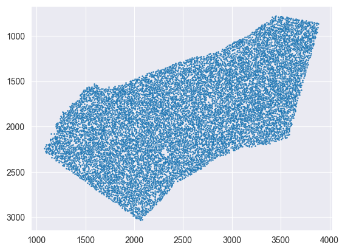

# Tutorial for mapping data with Tangram
by Tommaso Biancalani <biancalt@gene.com> and Ziqing Lu <luz21@gene.com>

- The notebook introduces to mapping single cell data on spatial data  using the Tangram method.
- The notebook uses data from mouse brain cortex (different than those adopted in the manuscript).

#### Last changelog
- June 13th - Tommaso Biancalani <biancalt@gene.com>

***
#### Installation

- Make sure `tangram-sc` is installed via `pip install tangram-sc`.
- Otherwise, edit and uncomment the line starting with `sys.path` specifying the Tangram folder.
- The Python environment needs to install the packages listed in `environment.yml`.


```python
import os, sys #导入os和sys模块
import numpy as np #导入numpy模块
import pandas as pd #导入pandas模块
import matplotlib.pyplot as plt #导入matplotlib.pyplot模块
import seaborn as sns #导入seaborn模块
import scanpy as sc #导入scanpy模块
import torch #导入torch模块
sys.path.append('./')  # uncomment for local import #将当前目录添加到系统路径中
import tangram as tg #导入tangram模块

%load_ext autoreload 
%autoreload 2 
%matplotlib inline

tg.__version__ #查看tangram版本
```


    '1.0.4'


***
#### Download the data
- If you have `wget` installed, you can run the following code to automatically download and unzip the data.


```python
# Skip this cells if data are already downloaded
# !wget https://storage.googleapis.com/tommaso-brain-data/tangram_demo/mop_sn_tutorial.h5ad.gz -O data/mop_sn_tutorial.h5ad.gz
# !wget https://storage.googleapis.com/tommaso-brain-data/tangram_demo/slideseq_MOp_1217.h5ad.gz -O data/slideseq_MOp_1217.h5ad.gz
# !wget https://storage.googleapis.com/tommaso-brain-data/tangram_demo/MOp_markers.csv -O data/MOp_markers.csv
# !gunzip -f data/mop_sn_tutorial.h5ad.gz
# !gunzip -f data/slideseq_MOp_1217.h5ad.gz
```

- If you do not have `wget` installed, manually download data from the links below:
    - snRNA-seq datasets collected from adult mouse cortex:  [10Xv3 MOp](https://storage.googleapis.com/tommaso-brain-data/tangram_demo/mop_sn_tutorial.h5ad.gz).
    - For spatial data, we will use one coronal slice of [Slide-seq2 data](
    https://storage.googleapis.com/tommaso-brain-data/tangram_demo/slideseq_MOp_1217.h5ad.gz) (adult mouse brain; MOp area).
    - We will map them via a few hundred [marker genes](https://storage.googleapis.com/tommaso-brain-data/tangram_demo/MOp_markers.csv), found in [literature](https://www.biorxiv.org/content/10.1101/2020.06.04.105700v1).
    - All datasets need to be unzipped: resulting `h5ad` and `csv` files should be placed in the `data` folder.

***
#### Load spatial data
- Spatial data need to be organized as a voxel-by-gene matrix. Here, Slide-seq data contains 9852 spatial voxels, in each of which there are 24518 genes measured.


```python
path = os.path.join('./data', 'slideseq_MOp_1217.h5ad') # 空间数据路径
ad_sp = sc.read_h5ad(path) # 读取空间数据
ad_sp 
```


    AnnData object with n_obs × n_vars = 9852 × 24518
        obs: 'orig.ident', 'nCount_RNA', 'nFeature_RNA', 'x', 'y'


```python
ad_sp.obs # 空间数据的中每个voxel的信息 
# 包括nCount_RNA:每个voxel的RNA数量 nFeature_RNA:每个voxel的RNA特征数量
# nFeature_RNA:每个voxel的RNA特征数量?
```


<div>
<style scoped>
    .dataframe tbody tr th:only-of-type {
        vertical-align: middle;
    }

    .dataframe tbody tr th {
        vertical-align: top;
    }
    
    .dataframe thead th {
        text-align: right;
    }
</style>
<table border="1" class="dataframe">
  <thead>
    <tr style="text-align: right;">
      <th></th>
      <th>orig.ident</th>
      <th>nCount_RNA</th>
      <th>nFeature_RNA</th>
      <th>x</th>
      <th>y</th>
    </tr>
  </thead>
  <tbody>
    <tr>
      <th>ACCGGAACTTCTTC</th>
      <td>0</td>
      <td>14520.0</td>
      <td>5453</td>
      <td>3259.4</td>
      <td>1233.7</td>
    </tr>
    <tr>
      <th>GGGGGGGGGGGGGG</th>
      <td>0</td>
      <td>22554.0</td>
      <td>8660</td>
      <td>1662.6</td>
      <td>2097.6</td>
    </tr>
    <tr>
      <th>AAAGACCCAAAGGC</th>
      <td>0</td>
      <td>10774.0</td>
      <td>4411</td>
      <td>3050.3</td>
      <td>1637.6</td>
    </tr>
    <tr>
      <th>TCGGCGGTATCATT</th>
      <td>0</td>
      <td>10581.0</td>
      <td>4033</td>
      <td>1389.3</td>
      <td>2045.8</td>
    </tr>
    <tr>
      <th>TACGCCGGTACTGG</th>
      <td>0</td>
      <td>11075.0</td>
      <td>4266</td>
      <td>3022.8</td>
      <td>1768.0</td>
    </tr>
    <tr>
      <th>...</th>
      <td>...</td>
      <td>...</td>
      <td>...</td>
      <td>...</td>
      <td>...</td>
    </tr>
    <tr>
      <th>CAGTTGTGGAGCAG</th>
      <td>0</td>
      <td>10.0</td>
      <td>10</td>
      <td>1803.7</td>
      <td>2009.3</td>
    </tr>
    <tr>
      <th>ACTATGGTGTATCA</th>
      <td>0</td>
      <td>10.0</td>
      <td>10</td>
      <td>3538.7</td>
      <td>1950.0</td>
    </tr>
    <tr>
      <th>CACCCCCTAGAAAT</th>
      <td>0</td>
      <td>10.0</td>
      <td>10</td>
      <td>2004.3</td>
      <td>2032.4</td>
    </tr>
    <tr>
      <th>AAAGAATACGTACC</th>
      <td>0</td>
      <td>10.0</td>
      <td>10</td>
      <td>2161.3</td>
      <td>2868.3</td>
    </tr>
    <tr>
      <th>TATTTGGGTTATTT</th>
      <td>0</td>
      <td>10.0</td>
      <td>10</td>
      <td>2057.4</td>
      <td>2417.3</td>
    </tr>
  </tbody>
</table>
<p>9852 rows × 5 columns</p>
</div>


- The voxel coordinates are saved in the fields `obs.x` and `obs.y` which we can use to visualize the spatial ROI. Each "dot" is the center of a 10um voxel.


```python
xs = ad_sp.obs.x.values # 每个voxel的x坐标 xs是一个一维向量
ys = ad_sp.obs.y.values # 每个voxel的y坐标 ys是一个一维向量
# plt.axis('off') # 关闭坐标轴
plt.scatter(xs, ys, s=.7) # 绘制散点图，s=.7表示散点的大小
plt.gca().invert_yaxis() # 反转y轴
```



    


***
#### Single cell data

- By single cell data, we generally mean either scRNAseq or snRNAseq.
- We start by mapping the MOp 10Xv3 dataset, which contains single nuclei collected from a posterior region of the primary motor cortex.
- They are approximately 26k profiled cells with 28k genes.

---
#### 单细胞数据
- 通常情况下，我们所指的单细胞数据要么是单细胞RNA测序（scRNAseq），要么是单细胞核RNA测序（snRNAseq）。
- 我们首先对包含来自初级运动皮层后部区域的单细胞核的MOp 10Xv3数据集进行了映射。
- 这个数据集包含大约26,000个已经被分析的细胞，拥有28,000个基因。
---


```python
path = os.path.join('data','mop_sn_tutorial.h5ad') # 单细胞数据路径
ad_sc = sc.read_h5ad(path)  # 读取单细胞数据
ad_sc  
```


    AnnData object with n_obs × n_vars = 26431 × 27742
        obs: 'QC', 'batch', 'class_color', 'class_id', 'class_label', 'cluster_color', 'cluster_labels', 'dataset', 'date', 'ident', 'individual', 'nCount_RNA', 'nFeature_RNA', 'nGene', 'nUMI', 'project', 'region', 'species', 'subclass_id', 'subclass_label'
        layers: 'logcounts'


```python
ad_sc.obs # 单细胞数据的每个细胞的信息
```


<div>
<style scoped>
    .dataframe tbody tr th:only-of-type {
        vertical-align: middle;
    }

    .dataframe tbody tr th {
        vertical-align: top;
    }
    
    .dataframe thead th {
        text-align: right;
    }
</style>
<table border="1" class="dataframe">
  <thead>
    <tr style="text-align: right;">
      <th></th>
      <th>QC</th>
      <th>batch</th>
      <th>class_color</th>
      <th>class_id</th>
      <th>class_label</th>
      <th>cluster_color</th>
      <th>cluster_labels</th>
      <th>dataset</th>
      <th>date</th>
      <th>ident</th>
      <th>individual</th>
      <th>nCount_RNA</th>
      <th>nFeature_RNA</th>
      <th>nGene</th>
      <th>nUMI</th>
      <th>project</th>
      <th>region</th>
      <th>species</th>
      <th>subclass_id</th>
      <th>subclass_label</th>
    </tr>
    <tr>
      <th>index</th>
      <th></th>
      <th></th>
      <th></th>
      <th></th>
      <th></th>
      <th></th>
      <th></th>
      <th></th>
      <th></th>
      <th></th>
      <th></th>
      <th></th>
      <th></th>
      <th></th>
      <th></th>
      <th></th>
      <th></th>
      <th></th>
      <th></th>
      <th></th>
    </tr>
  </thead>
  <tbody>
    <tr>
      <th>pBICCNsMMrMOpRPiM004d190318_CATTGCCGTGAGAGGG-4</th>
      <td>PassQC</td>
      <td>4</td>
      <td>#00ADEE</td>
      <td>2</td>
      <td>Glutamatergic</td>
      <td>#2EB934</td>
      <td>L2/3 IT_3</td>
      <td>2</td>
      <td>190318_CATTGCCGTGAGAGGG</td>
      <td>60</td>
      <td>M004</td>
      <td>15189.0</td>
      <td>4816</td>
      <td>3439</td>
      <td>8522.0</td>
      <td>BICCN</td>
      <td>MOpRP</td>
      <td>MM</td>
      <td>7</td>
      <td>L2/3 IT</td>
    </tr>
    <tr>
      <th>pBICCNsMMrMOpRPiM004d190318_TCAAGTGAGCACACAG-4</th>
      <td>PassQC</td>
      <td>4</td>
      <td>#00ADEE</td>
      <td>2</td>
      <td>Glutamatergic</td>
      <td>#338C5E</td>
      <td>L6 CT Cpa6</td>
      <td>2</td>
      <td>190318_TCAAGTGAGCACACAG</td>
      <td>79</td>
      <td>M004</td>
      <td>11818.0</td>
      <td>4031</td>
      <td>5166</td>
      <td>16883.0</td>
      <td>BICCN</td>
      <td>MOpRP</td>
      <td>MM</td>
      <td>13</td>
      <td>L6 CT</td>
    </tr>
    <tr>
      <th>pBICCNsMMrMOpRPiF008d190314_TTACGCCAGTCCCGAC-0</th>
      <td>PassQC</td>
      <td>0</td>
      <td>#00ADEE</td>
      <td>2</td>
      <td>Glutamatergic</td>
      <td>#69419D</td>
      <td>L6b Col6a1</td>
      <td>1</td>
      <td>190314_TTACGCCAGTCCCGAC</td>
      <td>84</td>
      <td>F008</td>
      <td>14412.0</td>
      <td>4863</td>
      <td>5042</td>
      <td>19064.0</td>
      <td>BICCN</td>
      <td>MOpRP</td>
      <td>MM</td>
      <td>14</td>
      <td>L6b</td>
    </tr>
    <tr>
      <th>pBICCNsMMrMOpRPiF005d190318_CTGCAGGCAGGCTATT-1</th>
      <td>PassQC</td>
      <td>1</td>
      <td>#808080</td>
      <td>3</td>
      <td>Non-Neuronal</td>
      <td>#8D7C5D</td>
      <td>Astro Aqp4_Slc7a10</td>
      <td>1</td>
      <td>190318_CTGCAGGCAGGCTATT</td>
      <td>93</td>
      <td>F005</td>
      <td>4739.0</td>
      <td>2384</td>
      <td>4270</td>
      <td>14240.0</td>
      <td>BICCN</td>
      <td>MOpRP</td>
      <td>MM</td>
      <td>16</td>
      <td>Astro</td>
    </tr>
    <tr>
      <th>pBICCNsMMrMOpRPiF006d190314_AATGCCACACTCTGCT-9</th>
      <td>PassQC</td>
      <td>9</td>
      <td>#808080</td>
      <td>3</td>
      <td>Non-Neuronal</td>
      <td>#8D7C5D</td>
      <td>Astro Aqp4_Slc7a10</td>
      <td>1</td>
      <td>190314_AATGCCACACTCTGCT</td>
      <td>93</td>
      <td>F006</td>
      <td>7462.0</td>
      <td>3036</td>
      <td>1556</td>
      <td>2822.0</td>
      <td>BICCN</td>
      <td>MOpRP</td>
      <td>MM</td>
      <td>16</td>
      <td>Astro</td>
    </tr>
    <tr>
      <th>...</th>
      <td>...</td>
      <td>...</td>
      <td>...</td>
      <td>...</td>
      <td>...</td>
      <td>...</td>
      <td>...</td>
      <td>...</td>
      <td>...</td>
      <td>...</td>
      <td>...</td>
      <td>...</td>
      <td>...</td>
      <td>...</td>
      <td>...</td>
      <td>...</td>
      <td>...</td>
      <td>...</td>
      <td>...</td>
      <td>...</td>
    </tr>
    <tr>
      <th>pBICCNsMMrMOpRPiF003d190318_TGTCAGATCGAGCCTG-11</th>
      <td>PassQC</td>
      <td>11</td>
      <td>#00ADEE</td>
      <td>2</td>
      <td>Glutamatergic</td>
      <td>#338C5E</td>
      <td>L6 CT Cpa6</td>
      <td>1</td>
      <td>190318_TGTCAGATCGAGCCTG</td>
      <td>79</td>
      <td>F003</td>
      <td>10983.0</td>
      <td>3886</td>
      <td>5410</td>
      <td>21221.0</td>
      <td>BICCN</td>
      <td>MOpRP</td>
      <td>MM</td>
      <td>13</td>
      <td>L6 CT</td>
    </tr>
    <tr>
      <th>pBICCNsMMrMOpRPiF008d190314_TGTGCGGAGCAGTCTT-0</th>
      <td>PassQC</td>
      <td>0</td>
      <td>#808080</td>
      <td>3</td>
      <td>Non-Neuronal</td>
      <td>#8BA38D</td>
      <td>PVM_1</td>
      <td>1</td>
      <td>190314_TGTGCGGAGCAGTCTT</td>
      <td>114</td>
      <td>F008</td>
      <td>1711.0</td>
      <td>1165</td>
      <td>4481</td>
      <td>11826.0</td>
      <td>BICCN</td>
      <td>MOpRP</td>
      <td>MM</td>
      <td>22</td>
      <td>Micro-PVM</td>
    </tr>
    <tr>
      <th>pBICCNsMMrMOpRPiF007d190314_TTTGATCAGCGAGGAG-3</th>
      <td>PassQC</td>
      <td>3</td>
      <td>#00ADEE</td>
      <td>2</td>
      <td>Glutamatergic</td>
      <td>#52B4B8</td>
      <td>L5 IT Pld5_2</td>
      <td>1</td>
      <td>190314_TTTGATCAGCGAGGAG</td>
      <td>66</td>
      <td>F007</td>
      <td>20215.0</td>
      <td>5642</td>
      <td>4892</td>
      <td>14704.0</td>
      <td>BICCN</td>
      <td>MOpRP</td>
      <td>MM</td>
      <td>8</td>
      <td>L5 IT</td>
    </tr>
    <tr>
      <th>pBICCNsMMrMOpRPiF003d190318_ATGTCTTGTAAGCAAT-11</th>
      <td>PassQC</td>
      <td>11</td>
      <td>#00ADEE</td>
      <td>2</td>
      <td>Glutamatergic</td>
      <td>#2EB934</td>
      <td>L2/3 IT_3</td>
      <td>1</td>
      <td>190318_ATGTCTTGTAAGCAAT</td>
      <td>60</td>
      <td>F003</td>
      <td>14461.0</td>
      <td>4520</td>
      <td>5027</td>
      <td>16698.0</td>
      <td>BICCN</td>
      <td>MOpRP</td>
      <td>MM</td>
      <td>7</td>
      <td>L2/3 IT</td>
    </tr>
    <tr>
      <th>pBICCNsMMrMOpRPiM003d190318_GCATCTCGTTTCGCTC-10</th>
      <td>PassQC</td>
      <td>10</td>
      <td>#808080</td>
      <td>3</td>
      <td>Non-Neuronal</td>
      <td>#8D6A62</td>
      <td>Endo</td>
      <td>2</td>
      <td>190318_GCATCTCGTTTCGCTC</td>
      <td>103</td>
      <td>M003</td>
      <td>3650.0</td>
      <td>1953</td>
      <td>4349</td>
      <td>12974.0</td>
      <td>BICCN</td>
      <td>MOpRP</td>
      <td>MM</td>
      <td>18</td>
      <td>Endo</td>
    </tr>
  </tbody>
</table>
<p>26431 rows × 20 columns</p>
</div>


```python
ad_sc.var # 单细胞数据的每个基因的信息
```


<div>
<style scoped>
    .dataframe tbody tr th:only-of-type {
        vertical-align: middle;
    }

    .dataframe tbody tr th {
        vertical-align: top;
    }
    
    .dataframe thead th {
        text-align: right;
    }
</style>
<table border="1" class="dataframe">
  <thead>
    <tr style="text-align: right;">
      <th></th>
    </tr>
    <tr>
      <th>index</th>
    </tr>
  </thead>
  <tbody>
    <tr>
      <th>Xkr4</th>
    </tr>
    <tr>
      <th>Gm1992</th>
    </tr>
    <tr>
      <th>Gm37381</th>
    </tr>
    <tr>
      <th>Rp1</th>
    </tr>
    <tr>
      <th>Sox17</th>
    </tr>
    <tr>
      <th>...</th>
    </tr>
    <tr>
      <th>Ins1</th>
    </tr>
    <tr>
      <th>AC133103.5</th>
    </tr>
    <tr>
      <th>AC165294.2</th>
    </tr>
    <tr>
      <th>AC125149.1</th>
    </tr>
    <tr>
      <th>AC125149.2</th>
    </tr>
  </tbody>
</table>
<p>27742 rows × 0 columns</p>
</div>


- Usually, we work with data in raw count form, especially if the spatial data are in raw count form as well.
- If the data are in integer format, that probably means they are in raw count.
---
- 通常情况下，我们使用原始计数形式的数据，特别是如果空间数据也是原始计数形式的。
- 如果数据是整数格式，那可能意味着它们是原始计数。


```python
np.unique(ad_sc.X.toarray()[0, :])  # 单细胞数据的第一个细胞的基因计数
#[0,:]选择了转换后的密集数组中的第一行（行索引为0），并选择了该行的所有列。
# 最后，np.unique() 是用于从数组中提取唯一值的NumPy函数。它将返回数组中不重复的值，并且这些值将按升序排列
```


    array([  0.,   1.,   2.,   3.,   4.,   5.,   6.,   7.,   8.,   9.,  10.,
            11.,  12.,  13.,  14.,  15.,  16.,  17.,  18.,  19.,  20.,  21.,
            22.,  23.,  24.,  25.,  26.,  27.,  28.,  29.,  30.,  31.,  33.,
            34.,  36.,  39.,  40.,  43.,  44.,  46.,  47.,  49.,  50.,  53.,
            56.,  57.,  58.,  62.,  68.,  69.,  73.,  77.,  80.,  85.,  86.,
            98., 104., 105., 118., 121., 126., 613.], dtype=float32)


- Here, we only do some light pre-processing as library size correction (in scanpy, via `sc.pp.normalize`) to normalize the number of count within each cell to a fixed number.
- Sometimes, we apply more sophisticated pre-processing methods, for example for batch correction, although mapping works great with raw data.
- Ideally, the single cell and spatial datasets, should exhibit signals as similar as possible and the pre-processing pipeline should be finalized to harmonize the signals.
---
- 在这里，我们只做了一些轻量级的预处理，如图书馆大小校正（在scanpy中，通过sc.pp.normalize）将每个细胞中的计数数量归一化为固定数量。
- 有时，我们会应用更复杂的预处理方法，例如批处理校正，尽管映射可以很好地处理原始数据。
- 理想情况下，单细胞和空间数据集应该尽可能地呈现相似的信号，并且预处理流程应该最终完成以协调信号。
---


```python
sc.pp.normalize_total(ad_sc) # library size correction # 标准化
```

- It is a good idea to have annotations in the single cell data, as they will be projected on space after we map.
- In this case, cell types are annotated in the `subclass_label` field, for which we plot cell counts.
- Note that cell type proportion should be similar in the two datasets: for example, if `Meis` is a rare cell type in the snRNA-seq then it is expected to be a rare one even in the spatial data as well.
---
- 在单细胞数据中添加注释是一个好主意，因为在我们进行映射之后，它们将被投射到空间上。
- 在这种情况下，细胞类型被注释在`subclass_label`字段中，我们将在其中绘制细胞计数。
- 请注意，在这两个数据集中，细胞类型的比例应该是相似的：例如，如果在snRNA-seq中`Meis`是一种罕见的细胞类型，那么在空间数据中它也应该是一种罕见的细胞类型。


```python
ad_sc.obs.subclass_label.value_counts() # cell type counts # 细胞类型计数
```


    L5 IT        5623
    Oligo        4330
    L2/3 IT      3555
    L6 CT        3118
    Astro        2600
    Micro-PVM    1121
    Pvalb         972
    L6 IT         919
    L5 ET         903
    L5/6 NP       649
    Sst           627
    Vip           435
    L6b           361
    Endo          357
    Lamp5         332
    VLMC          248
    Peri          187
    Sncg           94
    Name: subclass_label, dtype: int64


***
#### Prepare to map
---
#### 准备映射

- Tangram learns a spatial alignment of the single cell data so that  _the gene expression of the aligned single cell data is as similar as possible to that of the spatial data_.
- In doing this, Tangram only looks at a subset genes, specified by the user, called the training genes.
- The choice of the training genes is a delicate step for mapping: they need to bear interesting signals and to be measured with high quality.
- Typically, a good start is to choose 100-1000 top marker genes, evenly stratified across cell types. Sometimes, we also use the entire transcriptome, or perform different mappings using different set of training genes to see how much the result change.
- For this case, we choose 253 marker genes of the MOp area which were curated [in a different study](https://www.biorxiv.org/content/10.1101/2020.06.04.105700v1).
---
- Tangram学习单细胞数据的空间对齐，以便 _对齐后的单细胞数据的基因表达与空间数据的基因表达尽可能相似_。
- 在这样做时，Tangram只查看用户指定的一组基因子集，称为训练基因。
- 训练基因的选择是映射的一个微妙的步骤：它们需要承载有趣的信号并且具有高质量的测量。
- 通常，一个好的开始是选择100-1000个顶级标记基因，均匀分层在细胞类型之间。有时，我们也使用整个转录组，或者使用不同的训练基因集执行不同的映射，以查看结果的变化程度。
- 对于这种情况，我们选择了MOp区域的253个标记基因，这些基因在[不同的研究中进行了筛选](https://www.biorxiv.org/content/10.1101/2020.06.04.105700v1)。
---


```python
df_genes = pd.read_csv('data/MOp_markers.csv', index_col=0) # 读取基因列表 index_col=0表示第一列作为索引
markers = np.reshape(df_genes.values, (-1, ))   # 将基因列表转换为一维数组，-1表示自动计算行数
markers = list(markers) # 转换为列表
len(markers)    # 基因数量
markers
```


    ['1700022I11Rik',
     '1810046K07Rik',
     '5031425F14Rik',
     '5730522E02Rik',
     'Acta2',
     'Adam2',
     'Adamts2',
     'Adamts4',
     'Adra1b',
     'Alk',
     'Ankfn1',
     'Ano4',
     'Aqp4',
     'Asic4',
     'B4galnt2',
     'B4galnt3',
     'Barx2',
     'Bcl11b',
     'Bdnf',
     'Bgn',
     'Blnk',
     'Bmpr1b',
     'Brinp3',
     'C1ql3',
     'C1qtnf7',
     'Cacng5',
     'Calb1',
     'Calb2',
     'Camk2d',
     'Car3',
     'Cbln2',
     'Cbln4',
     'Ccbe1',
     'Ccdc162',
     'Ccdc3',
     'Ccdc80',
     'Ccnb1',
     'Cd14',
     'Cd24a',
     'Cdca7',
     'Cdcp1',
     'Cdh12',
     'Cdh13',
     'Cdh20',
     'Cdh9',
     'Ceacam9',
     'Cemip',
     'Chat',
     'Chn2',
     'Chodl',
     'Chrm2',
     'Chrna2',
     'Cldn5',
     'Clrn1',
     'Cnr1',
     'Cntnap5b',
     'Cobll1',
     'Col14a1',
     'Col15a1',
     'Col23a1',
     'Col24a1',
     'Col25a1',
     'Corin',
     'Cplx3',
     'Crhr2',
     'Crispld2',
     'Cspg4',
     'Ctss',
     'Cux2',
     'Cxcl14',
     'Daam2',
     'Dmkn',
     'Dnase1l3',
     'Dscaml1',
     'Egfem1',
     'Egfr',
     'Egln3',
     'Egr2',
     'Elfn1',
     'Enpp6',
     'Epha7',
     'Fam19a2',
     'Fam84b',
     'Fbxl7',
     'Fezf2',
     'Flrt3',
     'Flt1',
     'Fndc7',
     'Fosb',
     'Foxp2',
     'Frem2',
     'Fst',
     'Gad1',
     'Gad2',
     'Gfap',
     'Glra1',
     'Gpc6',
     'Grik1',
     'Grin3a',
     'Grm1',
     'Grm8',
     'Hpse',
     'Hs3st5',
     'Igf2',
     'Igfbp4',
     'Igfbp5',
     'Ikzf2',
     'Il1rapl2',
     'Il4ra',
     'Inpp4b',
     'Iqgap2',
     'Itgb8',
     'Kcng1',
     'Kcnj8',
     'L3mbtl4',
     'Lama3',
     'Lamp5',
     'Lhx6',
     'Lmo1',
     'Lsp1',
     'Ltf',
     'Luzp2',
     'Lypd1',
     'Lyzl4',
     'Marcksl1',
     'Meis2',
     'Moxd1',
     'Mrc1',
     'Mrgprx2',
     'Muc20',
     'Myh14',
     'Ndst4',
     'Nhs',
     'Nkain3',
     'Nnmt',
     'Nos1',
     'Npas1',
     'Npnt',
     'Npsr1',
     'Npy2r',
     'Nr2f2',
     'Nr4a1',
     'Nr4a2',
     'Ntng2',
     'Nxph1',
     'Nxph2',
     'Nxph4',
     'Olah',
     'Olfm3',
     'Opalin',
     'Oprk1',
     'Osr1',
     'Otof',
     'Parm1',
     'Pcdh8',
     'Pde11a',
     'Pdgfc',
     'Pdgfra',
     'Pdlim5',
     'Penk',
     'Phactr2',
     'Plch1',
     'Plcxd3',
     'Pld5',
     'Plekhg3',
     'Pou3f1',
     'Pou3f3',
     'Pou6f2',
     'Prdm8',
     'Prok2',
     'Prokr2',
     'Prox1',
     'Prr16',
     'Prss12',
     'Prss23',
     'Ptger3',
     'Ptprk',
     'Ptprm',
     'Ptprt',
     'Ptpru',
     'Pvalb',
     'Pxdc1',
     'Rab3b',
     'Ramp1',
     'Reln',
     'Rerg',
     'Rfx3',
     'Rgs5',
     'Rgs6',
     'Rnf152',
     'Ror1',
     'Rorb',
     'Rspo1',
     'Rxfp1',
     'Rxfp2',
     'Satb2',
     'Scgn',
     'Sema3e',
     'Sema5a',
     'Serpinf1',
     'Sertm1',
     'Sgcd',
     'Shisa9',
     'Slc17a6',
     'Slc17a7',
     'Slc17a8',
     'Slc25a13',
     'Slc30a3',
     'Slc32a1',
     'Slc44a5',
     'Slco5a1',
     'Sncg',
     'Sox10',
     'Sox6',
     'Sp8',
     'Spon1',
     'Sst',
     'St6galnac5',
     'Sulf1',
     'Sulf2',
     'Syndig1',
     'Syt10',
     'Syt6',
     'Tac2',
     'Tbc1d4',
     'Tcap',
     'Teddm3',
     'Tenm3',
     'Th',
     'Thbs2',
     'Thsd7a',
     'Timp3',
     'Tmem163',
     'Tmtc2',
     'Tnfaip6',
     'Tox',
     'Trp53i11',
     'Trpc4',
     'Trpc6',
     'Tshz2',
     'Tunar',
     'Ubash3b',
     'Unc13c',
     'Unc5b',
     'Unc5d',
     'Ust',
     'Vip',
     'Vipr2',
     'Vtn',
     'Vwc2',
     'Wipf3',
     'Wnt7b',
     'Zfp804b']


- We now need to prepare the datasets for mapping by creating `training_genes` field in `uns` dictionary of the two AnnData structures. 
- This `training_genes` field contains genes subset on the list of training genes. This field will be used later inside the mapping function to create training datasets.
- Also, the gene order needs to be the same in the datasets. This is because Tangram maps using only gene expression, so the $j$-th column in each matrix must correspond to the same gene.
- And if data entries of a gene are all zero, this gene will be removed
- This task is performed by the helper `pp_adatas`.
- In the pp_adatas function, the gene names are converted to lower case to get rid of the inconsistent capitalization. If this is not wanted, you can set the parameter gene_to_lowercase = False 
---
- 现在，我们需要通过在两个AnnData结构的`uns`字典中创建`training_genes`字段来准备映射的数据集。
- 这个`training_genes`字段包含了在训练基因列表上的基因子集。此字段稍后将在映射函数内部用于创建训练数据集。
- 此外，数据集中的基因顺序需要保持一致。这是因为Tangram仅使用基因表达来进行映射，因此每个矩阵中的第$j$列必须对应于相同的基因。
- 如果某个基因的所有数据条目都为零，那么将删除该基因。
- 这个任务由辅助函数`pp_adatas`执行。
- 在`pp_adatas`函数中，基因名称被转换为小写，以消除不一致的大写问题。如果不需要这样做，可以将参数`gene_to_lowercase`设置为`False`。


```python
tg.pp_adatas(ad_sc, ad_sp, genes=markers) # 准备映射数据
#INFO:root:已保存了249个训练基因在单细胞和空间AnnData的`uns``training_genes`字段中。
# INFO:root:已保存了18000个重叠基因在单细胞和空间AnnData的`uns``overlap_genes`字段中。
# INFO:root:已计算并保存了基于均匀分布的密度先验在空间AnnData的`obs``uniform_density`字段中。 怎么计算的？
# INFO:root:已计算并保存了基于RNA计数的密度先验在空间AnnData的`obs``rna_count_based_density`字段中。
```

    INFO:root:249 training genes are saved in `uns``training_genes` of both single cell and spatial Anndatas.
    INFO:root:18000 overlapped genes are saved in `uns``overlap_genes` of both single cell and spatial Anndatas.
    INFO:root:uniform based density prior is calculated and saved in `obs``uniform_density` of the spatial Anndata.
    INFO:root:rna count based density prior is calculated and saved in `obs``rna_count_based_density` of the spatial Anndata.


- You'll now notice that the two datasets now contain 249 genes, but 253 markers were provided.
- This is because the marker genes need to be shared by both dataset. If a gene is missing, `pp_adatas` will just take it out.
- Finally, the `assert` line below is a good way to ensure that the genes in the `training_genes` field in `uns` are actually ordered in both `AnnData`s.
---
- 现在，您会注意到这两个数据集现在包含249个基因，但是提供了253个标记。
- 这是因为标记基因需要被两个数据集共享。如果缺少一个基因，`pp_adatas`将把它拿出来。
- 最后，下面的`assert`行是一种很好的方法，可以确保`uns`中的`training_genes`字段中的基因实际上在两个`AnnData`中都是有序的。
- `assert`语句用于判断一个表达式，在表达式条件为 false 的时候触发异常。


```python
ad_sc 
```


    AnnData object with n_obs × n_vars = 26431 × 26496
        obs: 'QC', 'batch', 'class_color', 'class_id', 'class_label', 'cluster_color', 'cluster_labels', 'dataset', 'date', 'ident', 'individual', 'nCount_RNA', 'nFeature_RNA', 'nGene', 'nUMI', 'project', 'region', 'species', 'subclass_id', 'subclass_label'
        var: 'n_cells'
        uns: 'training_genes', 'overlap_genes'
        layers: 'logcounts'


```python
ad_sp
```


    AnnData object with n_obs × n_vars = 9852 × 20864
        obs: 'orig.ident', 'nCount_RNA', 'nFeature_RNA', 'x', 'y', 'uniform_density', 'rna_count_based_density'
        var: 'n_cells'
        uns: 'training_genes', 'overlap_genes'


```python
assert ad_sc.uns['training_genes'] == ad_sp.uns['training_genes'] # `assert`语句用于判断一个表达式，在表达式条件为 false 的时候触发异常。
```

***
#### Map

- We can now train the model (_ie_ map the single cell data onto space).
- Mapping should be interrupted after the score plateaus,which can be controlled by passing the `num_epochs` parameter. 
- The score measures the similarity between the gene expression of the mapped cells vs spatial data: higher score means better mapping.
- Note that we obtained excellent mapping even if Tangram converges to a low scores (the typical case is when the spatial data are very sparse): we use the score merely to assess convergence.
- If you are running Tangram with a GPU, uncomment `device=cuda:0` and comment the line `device=cpu`. On a MacBook Pro 2018, it takes ~1h to run. On a P100 GPU it should be done in a few minutes.
- For this basic mapping, we do not use regularizers. More sophisticated loss functions can be used using the Tangram library (refer to manuscript or dive into the code). For example, you can pass your `density_prior` with the hyperparameter `lambda_d` to regularize the spatial density of cells. Currently `uniform`, `rna_count_based` and customized input array are supported for `density_prior` argument.
- Instead of mapping single cells, we can "average" the cells within a cluster and map the averaged cells instead, which drammatically improves performances. This suggestion was proposed by Sten Linnarsson. To activate this mode, select `mode='clusters'` and pass the annotation field to `cluster_label`.
---
- 我们现在可以训练模型（即将单细胞数据映射到空间）。
- 映射应该在分数趋于平稳时中断，可以通过传递`num_epochs`参数来控制。 
- 分数衡量了映射细胞的基因表达与空间数据之间的相似性：分数越高，映射越好。
- 请注意，即使Tangram收敛到较低的分数（典型情况是当空间数据非常稀疏时），我们仍然可以获得出色的映射结果：我们仅使用分数来评估收敛性。
- 如果您在使用GPU上运行Tangram，请取消注释`device=cuda:0`并注释掉`device=cpu`这一行。在MacBook Pro 2018上运行大约需要1小时。在P100 GPU上，应该在几分钟内完成。
- 对于这种基本映射，我们不使用正则化器。可以使用Tangram库来使用更复杂的损失函数（请参考手稿或深入研究代码）。例如，您可以通过超参数`lambda_d`传递您的`density_prior`来对细胞的空间密度进行正则化。目前支持`density_prior`参数的`uniform`、`rna_count_based`和自定义输入数组。
- 与映射单个细胞不同，我们可以在一个聚类内“平均”细胞，然后映射平均细胞，这将极大地提高性能。这个建议是由Sten Linnarsson提出的。要激活此模式，请选择`mode='clusters'`并将注释字段传递给`cluster_label`。


```python
ad_map = tg.map_cells_to_space(
    adata_sc=ad_sc,
    adata_sp=ad_sp,
    device='cpu',
    # device='cuda:0',
)
```

    INFO:root:Allocate tensors for mapping.
    INFO:root:Begin training with 249 genes and rna_count_based density_prior in cells mode...
    INFO:root:Printing scores every 100 epochs.


    Score: 0.103, KL reg: 0.558


    ---------------------------------------------------------------------------
    
    KeyboardInterrupt                         Traceback (most recent call last)
    
    Cell In[14], line 1
    ----> 1 ad_map = tg.map_cells_to_space(
          2     adata_sc=ad_sc,
          3     adata_sp=ad_sp,
          4     device='cpu',
          5     # device='cuda:0',
          6 )


    File D:\CODE_DATA\Scientific_Research\Tangram\tangram\mapping_utils.py:316, in map_cells_to_space(adata_sc, adata_sp, cv_train_genes, cluster_label, mode, device, learning_rate, num_epochs, scale, lambda_d, lambda_g1, lambda_g2, lambda_r, lambda_count, lambda_f_reg, target_count, random_state, verbose, density_prior)
        310     mapper = mo.Mapper(
        311         S=S, G=G, d=d, device=device, random_state=random_state, **hyperparameters,
        312     )
        314     # TODO `train` should return the loss function
    --> 316     mapping_matrix, training_history = mapper.train(
        317         learning_rate=learning_rate, num_epochs=num_epochs, print_each=print_each,
        318     )
        320 # constrained mode
        321 elif mode == "constrained":


    File D:\CODE_DATA\Scientific_Research\Tangram\tangram\mapping_optimizer.py:187, in Mapper.train(self, num_epochs, learning_rate, print_each)
        184         training_history[keys[i]].append(str(run_loss[i]))
        186     optimizer.zero_grad()
    --> 187     loss.backward()
        188     optimizer.step()
        189 # take final softmax w/o computing gradients


    File D:\Code_Studio\My_env\envs\Pytorch\lib\site-packages\torch\_tensor.py:488, in Tensor.backward(self, gradient, retain_graph, create_graph, inputs)
        478 if has_torch_function_unary(self):
        479     return handle_torch_function(
        480         Tensor.backward,
        481         (self,),
       (...)
        486         inputs=inputs,
        487     )
    --> 488 torch.autograd.backward(
        489     self, gradient, retain_graph, create_graph, inputs=inputs
        490 )


    File D:\Code_Studio\My_env\envs\Pytorch\lib\site-packages\torch\autograd\__init__.py:197, in backward(tensors, grad_tensors, retain_graph, create_graph, grad_variables, inputs)
        192     retain_graph = create_graph
        194 # The reason we repeat same the comment below is that
        195 # some Python versions print out the first line of a multi-line function
        196 # calls in the traceback and some print out the last line
    --> 197 Variable._execution_engine.run_backward(  # Calls into the C++ engine to run the backward pass
        198     tensors, grad_tensors_, retain_graph, create_graph, inputs,
        199     allow_unreachable=True, accumulate_grad=True)


    KeyboardInterrupt: 


- The mapping results are stored in the returned `AnnData` structure, saved as `ad_map`, structured as following:
    - The cell-by-spot matrix `X` contains the probability of cell $i$ to be in spot $j$.
    - The `obs` dataframe contains the metadata of the single cells.
    - The `var` dataframe contains the metadata of the spatial data.
    - The `uns` dictionary contains a dataframe with various information about the training genes (saved ad `train_genes_df`).
- We can now save the mapping results for post-analysis.
---
- 映射结果存储在返回的`AnnData`结构中，保存为`ad_map`，其结构如下：
    - 细胞-spot矩阵 `X` 包含了细胞 $i$ 定位在斑点 $j$ 的概率。
    - `obs` 数据框包含了单个细胞的元数据。
    - `var` 数据框包含了空间数据的元数据。
    - `uns` 字典包含了有关训练基因的各种信息（保存为`train_genes_df`）。
- 我们现在可以保存映射结果以供后续分析使用。

***
#### Analysis

- The most common application for mapping single cell data onto space is to transfer the cell type annotations onto space.
- This is dona via `plot_cell_annotation`, which visualizes spatial probability maps of the `annotation` in the `obs` dataframe (here, the `subclass_label` field). You can set `robust` argument to `True` and at the same time set the `perc` argument to set the range to the colormap, which would help remove outliers.
- The following plots recover cortical layers of excitatory neurons and sparse patterns of glia cells. The boundaries of the cortex are defined by layer 6b (cell type _L6b_) and oligodendrocytes are found concentrated into sub-cortical region, as expected.
- Yet, the _VLMC_ cell type patterns does not seem correct: _VLMC_ cells are clustered in the first cortical layer, whereas here are sparse in the ROI. This usually means that either (1) we have not used good marker genes for _VLMC_ cells in our training genes (2) the present marker genes are very sparse in the spatial data, therefore they don't contain good mapping signal.
---
- 将单细胞数据映射到空间最常见的应用是将细胞类型的注释传输到空间中。
- 这是通过使用`plot_cell_annotation`来完成的，它可视化了`obs`数据框中的`annotation`（在这里是`subclass_label`字段）的空间概率图。您可以将`robust`参数设置为`True`，同时设置`perc`参数来调整颜色映射的范围，以帮助去除异常值。
- 以下图表展示了兴奋性神经元的皮层层次结构和胶质细胞的稀疏模式。皮层的边界由第六层（细胞类型_L6b_）定义，而寡养细胞则集中在次皮层区域，正如预期的那样。
- 然而，_VLMC_细胞类型的模式似乎不正确：_VLMC_细胞在第一皮层中成簇，而在ROI中却分散稀疏。这通常意味着要么（1）我们没有在训练基因中使用好的_VLMC_细胞标记基因，要么（2）现有的标记基因在空间数据中非常稀疏，因此它们不包含良好的映射信号。


```python
import tangram as tg

tg.project_cell_annotations(ad_map, ad_sp, annotation='subclass_label')
annotation_list = list(pd.unique(ad_sc.obs['subclass_label']))
tg.plot_cell_annotation_sc(ad_sp, annotation_list,x='x', y='y',spot_size= 60, scale_factor=0.1, perc=0.001)
```


    ---------------------------------------------------------------------------
    
    NameError                                 Traceback (most recent call last)
    
    Cell In[15], line 3
          1 import tangram as tg
    ----> 3 tg.project_cell_annotations(ad_map, ad_sp, annotation='subclass_label')
          4 annotation_list = list(pd.unique(ad_sc.obs['subclass_label']))
          5 tg.plot_cell_annotation_sc(ad_sp, annotation_list,x='x', y='y',spot_size= 60, scale_factor=0.1, perc=0.001)


    NameError: name 'ad_map' is not defined


- Let's try to get a deeper sense of how good this mapping is. A good helper is `plot_training_scores` which gives us four panels:
    - The first panels is a histogram of the simlarity score for each training gene. Most genes are mapped with very high similarity (> .9) although few of them have score ~.5. We would like to understand why for these genes the score is lower.
    - The second panel shows that there is a neat correlation between the training score of a gene (y-axis) and the sparsity of that gene in the snRNA-seq data (x-axis). Each dot is a training gene. The trend is that the sparser the gene the higher the score: this usually happens because very sparse gene are easier to map, as their pattern is matched by placing a few "jackpot cells" in the right spots.
    - The third panel is similar to the second one, but contains the gene sparsity of the spatial data. Spatial data are usually more sparse than single cell data, a discrepancy which is often responsible for low quality mapping.
    - In the last panel, we show the training scores as a function of the difference in sparsity between the dataset. For genes with comparable sparsity, the mapped gene expression is very similar to that in the spatial data. However, if a gene is quite sparse in one dataset (typically, the spatial data) but not in other, the mapping score is lower. This occurs as Tangram cannot properly matched the gene pattern because of inconsistent amount of dropouts between the datasets.


```python
tg.plot_training_scores(ad_map, bins=10, alpha=.5)
```

- Although the above plots give us a summary of scores at single-gene level, we would need to know _which_ are the genes are mapped with low scores.
- These information can be access from the dataframe `.uns['train_genes_df']` from the mapping results; this is the dataframe used to build the four plots above.

- We want to inspect gene expression of training genes mapped with low scores, to understand the quality of mapping. 
- First, we need to generate "new spatial data" using the mapped single cell: this is done via `project_genes`.
- The function accepts as input a mapping (`adata_map`) and corresponding single cell data (`adata_sc`).
- The result is a voxel-by-gene `AnnData`, formally similar to `ad_sp`, but containing gene expression from the mapped single cell data rather than Slide-seq.


```python
ad_ge = tg.project_genes(adata_map=ad_map, adata_sc=ad_sc)
ad_ge
```

- We now choose a few training genes mapped with low score.


```python
genes = ['rgs6', 'satb2',  'cdh12']
ad_map.uns['train_genes_df'].loc[genes]
```

- To visualize gene patterns, we use the helper `plot_genes`. This function accepts two voxel-by-gene `AnnData`: the actual spatial data  (`adata_measured`), and a Tangram spatial prediction (`adata_predicted`). The function returns gene expression maps from the two spatial `AnnData` on the genes `genes`.
- As expected, the predited gene expression is less sparse albeit the main patterns are captured. For these genes, we trust more the mapped gene patterns, as Tangram "corrects" gene expression by aligning in space less sparse data.


```python
tg.plot_genes_sc(genes, adata_measured=ad_sp, adata_predicted=ad_ge, spot_size=50, scale_factor=0.1, perc = 0.001, return_figure=False)
```

- An even stronger example is found in genes that are not detected in the spatial data, but are detected in the single cell data. They are removed before training with `pp_adatas` function. But tangram could still generate insight on how the spatial patterns look like.


```python
genes=['mrgprx2', 'muc20', 'chrna2']
tg.plot_genes_sc(genes, adata_measured=ad_sp, adata_predicted=ad_ge, spot_size=50, scale_factor=0.1, perc=0.001, return_figure=False)
```

- So far, we only inspected genes used to align the data (training genes), but the mapped single cell data, `ad_ge` contains the whole transcriptome. That includes more than 26k test genes.


```python
(ad_ge.var.is_training == False).sum()
```

- We can use `plot_genes` to inspect gene expression of non training genes. This is an essential step as prediction of gene expression is the how we validate mapping.
- Before doing that, it is convenient to compute the similarity scores of all genes, which can be done by `compare_spatial_geneexp`. This function accepts two spatial `AnnData`s (_ie_ voxel-by-gene), and returns a dataframe with simlarity scores for all genes. Training genes are flagged by the Boolean field `is_training`.
- If we also pass single cell `AnnData` to `compare_spatial_geneexp` function like below, a dataframe with additional sparsity columns - sparsity_sc (single cell data sparsity) and sparsity_diff (spatial data sparsity - single cell data sparsity) will return. This is required if we want to call `plot_test_scores` function later with the returned datafrme from `compare_spatial_geneexp` function.


```python
df_all_genes = tg.compare_spatial_geneexp(ad_ge, ad_sp, ad_sc)
df_all_genes
```

- The plot below give us a summary of scores at single-gene level for test genes


```python
tg.plot_auc(df_all_genes)
```

- Let's plot the scores of the test genes and see how they compare to the training genes. Following the strategy in the previous plots, we visualize the scores as a function of the sparsity of the spatial data.
- (We have not wrapped this call into a function yet).

- Again, sparser genes in the spatial data are predicted with low scores, which is due to the presence of dropouts in the spatial data.
- Let's choose a few test genes with varied scores and compared predictions vs measured gene expression.


```python
genes = ['snap25', 'atp1b1', 'atp1a3', 'ctgf', 'nefh', 'aak1', 'fa2h', ]
df_all_genes.loc[genes]
```

- We can use again `plot_genes` to visualize gene patterns.
- Interestingly, the agreement for genes `Atp1b1` or `Apt1a3`, seems less good than that for `Ctgf` and `Nefh`, despite the scores are higher for the former genes. This is because even though the latter gene patterns are localized correctly, their expression values are not so well correlated (for instance, in `Ctgf` the "bright yellow spot" is in different part of layer 6b). In contrast, for `Atpb1` the gene expression pattern is largely recover, even though the overall gene expression in the spatial data is more dim.


```python
tg.plot_genes_sc(genes, adata_measured=ad_sp, adata_predicted=ad_ge, spot_size=50, scale_factor=0.1, perc=0.001, return_figure=False)
```

***
#### Leave-One-Out Cross Validation (LOOCV)

- If number of genes is small, Leave-One-Out cross validation (LOOCV) is supported in Tangram to evaluate mapping performance. 
- LOOCV supported by Tangram:
    - Assume the number of genes we have in the dataset is N. 
    - LOOCV would iterate over and map on the genes dataset N times.
    - Each time it hold out one gene as test gene (1 test gene) and trains on the rest of all genes (N-1 training genes).
    - After all trainings are done, average test/train score will be computed to evaluate the mapping performance.
- Assume all genes we have is the training genes in the example above. Here we demo the LOOCV mapping at cluster level. 
- Restart the kernel and load single cell, spatial and gene markers data
- Run `pp_adatas` to prepare data for mapping


```python
import os, sys
import numpy as np
import pandas as pd
import matplotlib.pyplot as plt
import scanpy as sc
import torch
import tangram as tg
```


```python
path = os.path.join('data', 'slideseq_MOp_1217.h5ad')
ad_sp = sc.read_h5ad(path)

path = os.path.join('data','mop_sn_tutorial.h5ad')
ad_sc = sc.read_h5ad(path)
sc.pp.normalize_total(ad_sc)

df_genes = pd.read_csv('data/MOp_markers.csv', index_col=0)
markers = np.reshape(df_genes.values, (-1, ))
markers = list(markers)

tg.pp_adatas(ad_sc, ad_sp, genes=markers)
```


```python
cv_dict, ad_ge_cv, df = tg.cross_val(ad_sc, 
                                     ad_sp, 
                                     device='cuda:0', 
                                     mode='clusters',
                                     cv_mode='loo',
                                     num_epochs=1000,
                                     cluster_label='subclass_label',
                                     return_gene_pred=True,
                                     verbose=False,
                                     )
```

* `cross_val` function will return `cv_dict` and `ad_ge_cv` and `df_test_genes` in `LOOCV` mode. `cv_dict` contains the average score for cross validation, `ad_ge_cv` stores the predicted expression value for each gene, and `df_test_genes` contains scores and sparsity for each test genes.


```python
cv_dict
```

* We can use `plot_test_scores` to display an overview of the cross validation test scores of each gene vs. sparsity. 


```python
tg.plot_test_scores(df, bins=10, alpha=.7)
```

- Now, let's compare a few genes between their ground truth and cross-validation predicted spatial pattern by calling the function `plot_genes`


```python
ad_ge_cv.var.sort_values(by='test_score', ascending=False)
```


```python
ranked_genes = list(ad_ge_cv.var.sort_values(by='test_score', ascending=False).index.values)
top_genes = ranked_genes[:3]
bottom_genes = ranked_genes[-3:]
```


```python
tg.plot_genes_sc(genes=top_genes, adata_measured=ad_sp, adata_predicted=ad_ge_cv, x = 'x', y='y',spot_size=50, scale_factor=0.1, perc=0.001, return_figure=False)
```


```python
tg.plot_genes_sc(genes=bottom_genes, adata_measured=ad_sp, adata_predicted=ad_ge_cv,x='x', y='y', spot_size=50, scale_factor=0.1, perc=0.001, return_figure=False)
```
